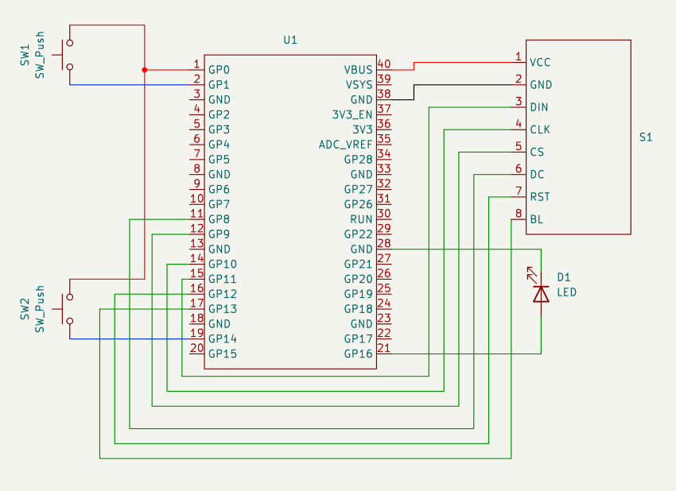

# Pico MiniGame

The Pico MiniGame is a game where you have to scape red boxes which will hurt you when they touch you. 
You have Energy and Speed boosts to help you with this. 
Enegy is used to activate an immunity mode 
which will make you immune to the red boxes while also destroying them on contact. 
While speed boost will just   

# Gameplay
<iframe width="560" height="315" src="https://www.youtube.com/embed/mGq_IOV7r4Y?si=BwyjoiaQS1UbABmG" title="YouTube video player" frameborder="0" allow="accelerometer; autoplay; clipboard-write; encrypted-media; gyroscope; picture-in-picture; web-share" allowfullscreen></iframe>

# Build
1. First download the [Pico SDK](https://github.com/raspberrypi/pico-sdk.git).

2. Inside [build.sh](./build.sh) replace PICO_SDK_PATH the path where you downloaded the Pico SDK. 

3. Run [build.sh](./build.sh).
    - This executable will create the build folder and run the cmake and make commands for you

4. Move the file [GAME.uf2](./build/GAME.uf2) inside the pico to start playing. 
    - Once you have the file inside the pico if the screen is connected properly it should display "Press [Any] To Start". 

# Schematics
### Pi pinout  

### My Schematics

